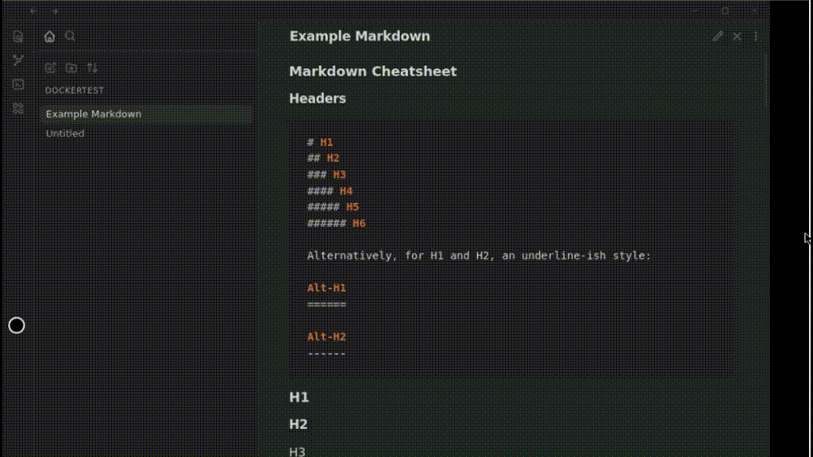

# obsidian-remote

This docker image allows you to run [obsidian](https://obsidian.md/) in docker as a container and access it via your web browser.

Use `http://localhost:8080/` to access it locally, do not expose this to the web unless you secure it and know what you are doing!!

- [Using the Container](#using-the-container)
  - [Ports](#ports)
  - [Mapped Volumes](#mapped-volumes)
  - [Environment Variables](#environment-variables)
- [Using Docker Compose](#using-docker-compose)
- [Enabling GIT for the obsidian-git plugin](#enabling-git-for-the-obsidian-git-plugin)
  - [Docker CLI example](#docker-cli-example)
- [Reloading Obsidan in the Browser](#reloading-obsidan-in-the-browser)
- [Setting PUID and PGID](#setting-puid-and-pgid)
- [Adding missing fonts](#adding-missing-fonts)
  - [Map font file using Docker CLI](#map-font-file-using-docker-cli)
  - [Map font file using Docker Compose](#map-font-file-using-docker-compose)
- [Hosting behind a reverse proxy](#hosting-behind-a-reverse-proxy)
  - [Example nginx configuration](#example-nginx-configuration)
- [Hosting behind Nginx Proxy Manager (NPM)](#hosting-behind-nginx-proxy-manager-npm)
- [Updating Obsidian](#updating-obsidian)
- [Building locally](#building-locally)
- [Copy/Paste From External Source](#copypaste-from-external-source)

## Using the Container

To run a interactive version to test it out. This is using windows based path, update for the OS you are running on.

```PowerShell
docker run --rm -it `
  -v D:/ob/vaults:/vaults `
  -v D:/ob/config:/config `
  -p 8080:8080 `
  ghcr.io/sytone/obsidian-remote:latest
```

To run it as a daemon in the background.

```PowerShell
docker run -d `
  -v D:/ob/vaults:/vaults `
  -v D:/ob/config:/config `
  -p 8080:8080 `
  ghcr.io/sytone/obsidian-remote:latest
```

The ARM container is now avaliable, will look to make this simpler in the future. The ARM imange is on the docker hub and not the github container registry. 

```PowerShell
docker run -d `
  -v D:/ob/vaults:/vaults `
  -v D:/ob/config:/config `
  -p 8080:8080 `
  sytone/obsidian-remote:latest
```

### Ports

| Port  | Description                             |
| ----- | --------------------------------------- |
| 8080  | HTTP Obsidian Web Interface             |
| 8443  | HTTPS Obsidian Web Interface            |

### Mapped Volumes

| Path      | Description                                                               |
| --------- | ------------------------------------------------------------------------- |
| `/vaults` | The location on the host for your Obsidian Vaults                         |
| `/config` | The location to store Obsidan configuration and ssh data for obsidian-git |

### Environment Variables

| Environment Variable | Description                                                                                                                                                                                                                         |
| -------------------- | ----------------------------------------------------------------------------------------------------------------------------------------------------------------------------------------------------------------------------------- |
| PUID                 | Set the user ID for the container user. `911` by default.                                                                                                                                                                           |
| PGID                 | Set the group ID for the continer user. `911` by default.                                                                                                                                                                           |
| TZ                   | Set the Time Zone for the container, should match your TZ. `Etc/UTC` by default. See [List of tz database time zones](https://en.wikipedia.org/wiki/List_of_tz_database_time_zones) for valid options.                              |
| DOCKER_MODS          | Use to add mods to the container like git. E.g. `DOCKER_MODS=linuxserver/mods:universal-git` See [Docker Mods](https://github.com/linuxserver/docker-mods) for details.                                                             |
| KEYBOARD             | Used to se the keyboard being used for input. E.g. `KEYBOARD=en-us-qwerty` or `KEYBOARD=de-de-qwertz` a list of other possible values (not tested) can be found at <https://github.com/linuxserver/docker-digikam#keyboard-layouts> |
| CUSTOM_PORT          | Internal port the container listens on for http if it needs to be swapped from the default 3000.                                                                                                                                    |
| CUSTOM_HTTPS_PORT    | Internal port the container listens on for https if it needs to be swapped from the default 3001.                                                                                                                                   |
| CUSTOM_USER          | HTTP Basic auth username, abc is default.                                                                                                                                                                                           |
| PASSWORD             | HTTP Basic auth password, abc is default. If unset there will be no auth                                                                                                                                                            |
| SUBFOLDER            | Subfolder for the application if running a subfolder reverse proxy, need both slashes IE `/subfolder/`                                                                                                                              |
| TITLE                | The page title displayed on the web browser, default "KasmVNC Client".                                                                                                                                                              |
| FM_HOME              | This is the home directory (landing) for the file manager, default "/config".                                                                                                                                                       |

## Using Docker Compose

```YAML
services:
  obsidian:
    image: 'ghcr.io/sytone/obsidian-remote:latest'
    container_name: obsidian-remote
    restart: unless-stopped
    ports:
      - 8080:8080
      - 8443:8443
    volumes:
      - /home/obsidian/vaults:/vaults
      - /home/obsidian/config:/config
    environment:
      - PUID=1000
      - PGID=1000
      - TZ=America/Los_Angeles
      - DOCKER_MODS=linuxserver/mods:universal-git
      - CUSTOM_PORT="8080"
      - CUSTOM_HTTPS_PORT="8443" 
      - CUSTOM_USER=""
      - PASSWORD=""
      - SUBFOLDER=""
```

## Enabling GIT for the obsidian-git plugin

This container uses the base images from linuxserver.io. This means you can the linuxserver.io mods. To add support for git add the `DOCKER_MODS` environment variable like so `DOCKER_MODS=linuxserver/mods:universal-git`.

### Docker CLI example

```PowerShell
docker run -d `
  -v D:/ob/vaults:/vaults `
  -v D:/ob/config:/config `
  -p 8080:8080 `
  -e DOCKER_MODS=linuxserver/mods:universal-git `
  ghcr.io/sytone/obsidian-remote:latest
```

## Reloading Obsidan in the Browser

If you make changes to plugins or do updates that need to have obsidian restarted, instead of having to stop and start the docker container you can just close the Obsidian UI and right click to show the menus and reopen it. Here is a short clip showing how to do it.



## Setting PUID and PGID

To set PUID and PGID use the follow environment variables on the command line, by default the IDs are 911/911

```PowerShell
docker run --rm -it `
  -v D:/ob/vaults:/vaults `
  -v D:/ob/config:/config `
  -e PUID=1000 `
  -e PGID=1000 `
  -p 8080:8080 `
  ghcr.io/sytone/obsidian-remote:latest
```

Or, if you use docker-compose, add them to the environment: section:

```yaml
environment:
  - PUID=1000
  - PGID=1000
```

It is most likely that you will use the id of yourself, which can be obtained by running the command below. The two values you will be interested in are the uid and gid.

```powershell
id $user
```

## Adding missing fonts

Thanks to @aaron-jang for this example.

Download the font of the language that you want to use in Obsidian and add it to the volume as shown below.

### Map font file using Docker CLI

```PowerShell
  -v {downloaded font directory}:/usr/share/fonts/truetype/{font name}
```

### Map font file using Docker Compose

```PowerShell
    volumes:
      - {downloaded font directory}:/usr/share/fonts/truetype/{font name}
```

## Hosting behind a reverse proxy

If you wish to do that **please make sure you are securing it in some way!**. You also need to ensure **websocket** support is enabled.

### Example nginx configuration

This is an example, I recommend a SSL based proxy and some sort of authentication.

```
server {
  set $forward_scheme http;
  set $server         "10.10.10.10";
  set $port           8080;

  listen 80;
  server_name ob.mycooldomain.com;
  proxy_set_header Upgrade $http_upgrade;
  proxy_set_header Connection $http_connection;
  proxy_http_version 1.1;
  access_log /data/logs/ob_access.log proxy;
  error_log /data/logs/ob_error.log warn;
  location / {
    proxy_set_header Upgrade $http_upgrade;
    proxy_set_header Connection $http_connection;
    proxy_http_version 1.1;
    # Proxy!
    add_header       X-Served-By $host;
    proxy_set_header Host $host;
    proxy_set_header X-Forwarded-Scheme $scheme;
    proxy_set_header X-Forwarded-Proto  $scheme;
    proxy_set_header X-Forwarded-For    $remote_addr;
    proxy_set_header X-Real-IP          $remote_addr;
    proxy_pass       $forward_scheme://$server:$port$request_uri;
  }
}
```

## Hosting behind Nginx Proxy Manager (NPM)

Thanks to @fahrenhe1t for this example.

If you install obsidian-remote in Docker, you can proxy it through [Nginx Proxy Manager](https://nginxproxymanager.com/) (NPM - running on the same Docker instance), and use an access list to provide user authentication. The obsidian-remote container would have to be on the same network as Nginx Proxy Manager. If you don't expose the IP external to the container, authentication would be forced through NPM:

```yaml
services:
  obsidian:
    image: 'ghcr.io/sytone/obsidian-remote:latest'
    container_name: obsidian-remote
    restart: unless-stopped
    ports:
      - 8080 #only exposes port internally to the container
    volumes:
      - /home/obsidian/vaults:/vaults
      - /home/obsidian/config:/config
    environment:
      - PUID=1000
      - PGID=1000
      - TZ=America/Los_Angeles
      - DOCKER_MODS=linuxserver/mods:universal-git
networks:
  default:
    name: <your nginx proxy manager network>
    external: true
```

Create a proxy host in NPM pointing to the "obsidian-remote:8080" container, choose your domain name, use a LetsEncrypt SSL certificate, enable WebSockets. This video talks about it: [Nginx Proxy Manager - ACCESS LIST protection for internal services](https://www.youtube.com/watch?v=G9voYZejH48)

## Updating Obsidian

By default obsidian will update itself in the container. If you recreate the container you will have to do the update again. This repo will be updated periodically to keep up with the latest version of Obsidian.

## Building locally

To build and use it locally run the following commands:

```PowerShell
docker build --pull --rm `
  -f "Dockerfile" `
  -t obsidian-remote:latest `
  "."
```

To run the localy build image:

```PowerShell
docker run --rm -it `
  -v D:/ob/vaults:/vaults `
  -v D:/ob/config:/config `
  -p 8080:8080 `
  obsidian-remote:latest bash
```


## Copy/Paste From External Source

Click on the circle to the left side of your browser window. In there you will find a textbox for updating the remote clipboard or copying from it.


